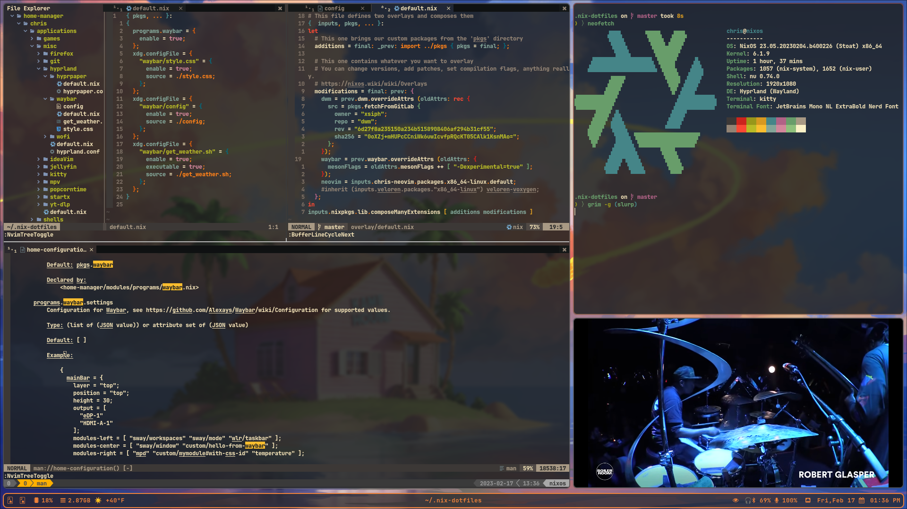

# Nix Config

This is my personalized configuration for nix and nixos systems.
This is incredibly customized and subject to force pushes and
general chaos and should only be forked or used as a reference.

## Usage

- Use `nix develop` to create a bootstrap shell.
- Run `sudo nixos-rebuild switch --flake .#hostname` to apply your system configuration.
    - If you're still on a live installation medium, run `nixos-install --flake .#hostname` instead, and reboot.
- Run `home-manager switch --flake .#username@hostname` to apply your home configuration.
