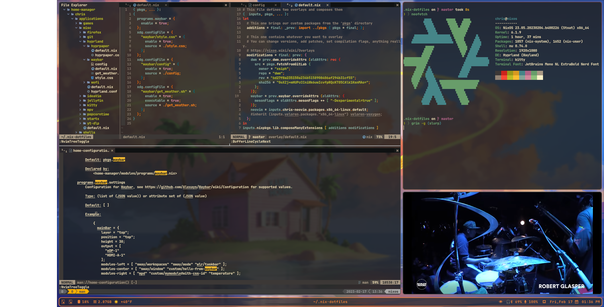
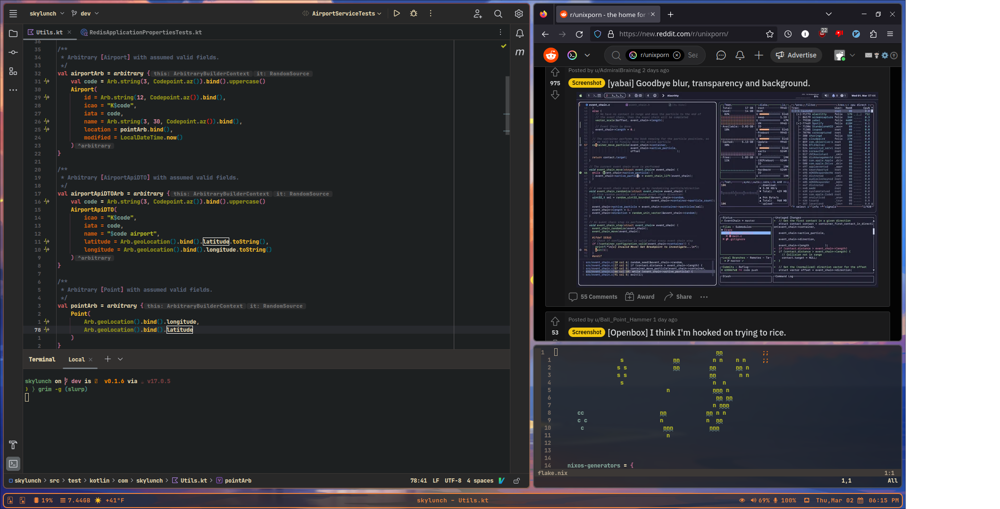

# Nix Config

This is my personalized configuration for nix and nixos systems. This is
incredibly customized and subject to force pushes and general chaos and should
only be forked or used as a reference. This configuration is built on top of
the
[nix-starter-configs](https://github.com/Misterio77/nix-starter-configs/tree/main)
template.

## Screenshots





## Workflow

This is primarily a NixOS config but is mostly portable to non-NixOS machines
via nix + home-manager. This is a developers machine but is also general
purpose and used for everyday tasks. It can play games with Steam plus some
native nix packaged games and edit audio projects with Ardour.

Development is done in neovim + tmux and Intellij Idea CE. The neovim
configuration lives in it's own
[repository](https://www.github.com/siph/neovim-flake) and is complete with
LSP, syntax highlighting, debugging and more. Hyprland and DWM provide
mouse-free window management. This combined with editor keybinds/configurations
means that a majority of things can be accomplished without leaving home-row.

### Applications

There are too many applications to mention but some primary applications are:

- **Terminal**
    - kitty
- **Shells**
    - nushell
    - zsh
    - bash
- **Editors**
    - neovim
    - Idea CE
- **Browser**
    - Firefox
- **Desktop Environments**
    - KDE Plasma
    - Hyprland
    - DWM

## Usage

### Installing

- Use `nix develop` to create a bootstrap shell.
- Run `sudo nixos-rebuild switch --flake .#hostname` to apply your system
  configuration.
    - If you're still on a live installation medium, run `nixos-install --flake
      .#hostname` instead, and reboot.
- Run `home-manager switch --flake .#username@hostname` to apply your home
  configuration.

### Starting Desktop Environments

This config does not use a login-manager and instead uses wrapper scripts to
launch a DE/WM with it's configurations directly from a tty. There are three
desktop environments/window managers. The scripts are built and placed on PATH
automatically by nix.

#### KDE

Launch xsession KDE5 session.
```shell
startx-kde
```

#### Hyprland

Launch hyprland with waybar + extras.
```shell
start-hyprland
```

#### DWM

Launch [configured DWM](https://www.gitlab.com/xsiph/dwm) session + extras.
```shell
startx-dwm
```


